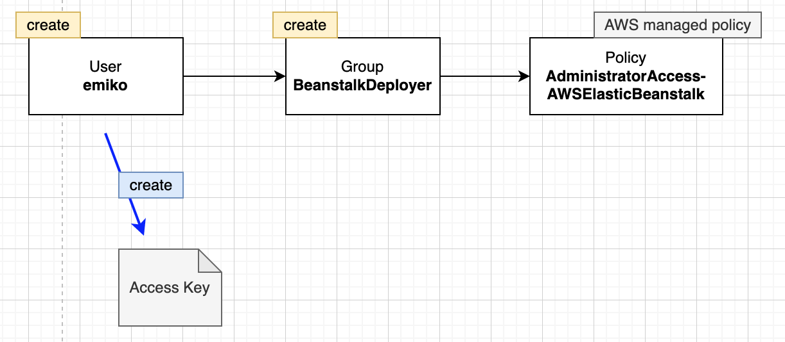
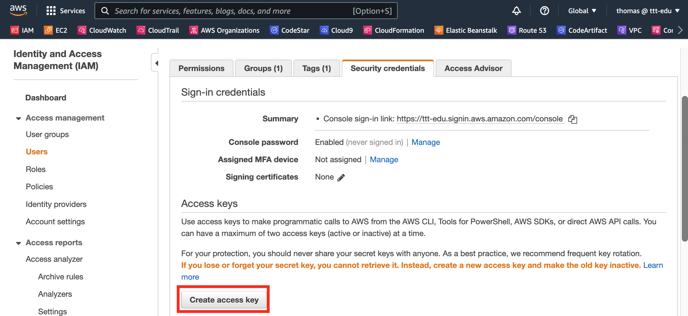
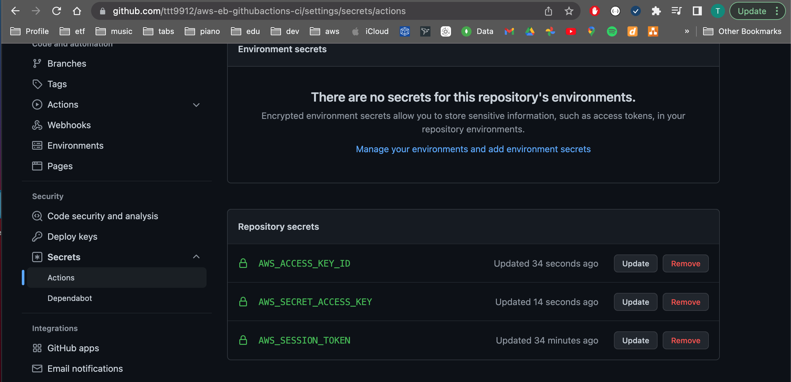
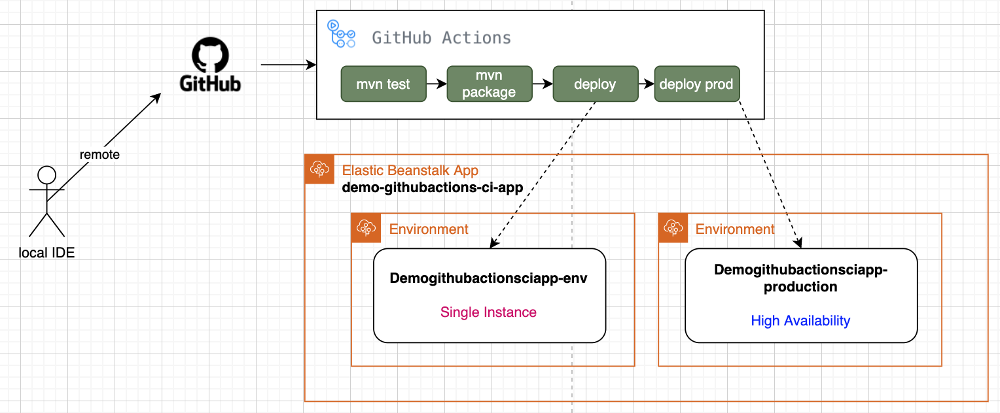

## Link
https://aws.plainenglish.io/hands-on-ci-cd-for-spring-boot-applications-using-github-actions-and-aws-1cbc1e2c9d54

## GitHub Actions
- will execute all .yml inside .github/workflows

#### Jobs
- are run parallel
- use **needs** to make sure another job is run first (e.g. needs: build)

##  Elastic Beanstalk

### Create Application
- Name: demo-githubactions-ci-app
- (Create Environment window comes automatically on the first ever Application)

### Create Environments
- Name: Demogithubactionsciapp-env 
  - Java Corretto 11 V3.1.8
  - Code: sample application
  - Configure More Options: **Single Instance**

- Name: Demogithubactionsciapp-production
  - Java Corretto 11 V3.1.8
  - Code: sample application
  - Configure More Options: **High Availability**

#### Single instance
  - Defaults:
    - ASG min 1 max 1
    - no Load Balancer
    
#### High Availability
  - Defaults:
    - ASG min 1 max 4
    - Application Load Balancer
    - Multi AZ

## AWS Credentials
1. Create user with access to Elastic Beanstalk
   

2. Create Access keys for this user
   
   - generates AWS_ACCESS_KEY_ID & AWS_SECRET_ACCESS_KEY

3. Create AWS_SESSION_TOKEN

### GitHub secrets
- AWS_ACCESS_KEY_ID
- AWS_SECRET_ACCESS_KEY
- AWS_SESSION_TOKEN (optional)

### GitHub Actions Workflow

1. Create File .github/workflows/build.yml
   - Jobs: test, build, deploy

2. server.port=5000

3. Git push
   - Workflow will be executed automatically

## Result

