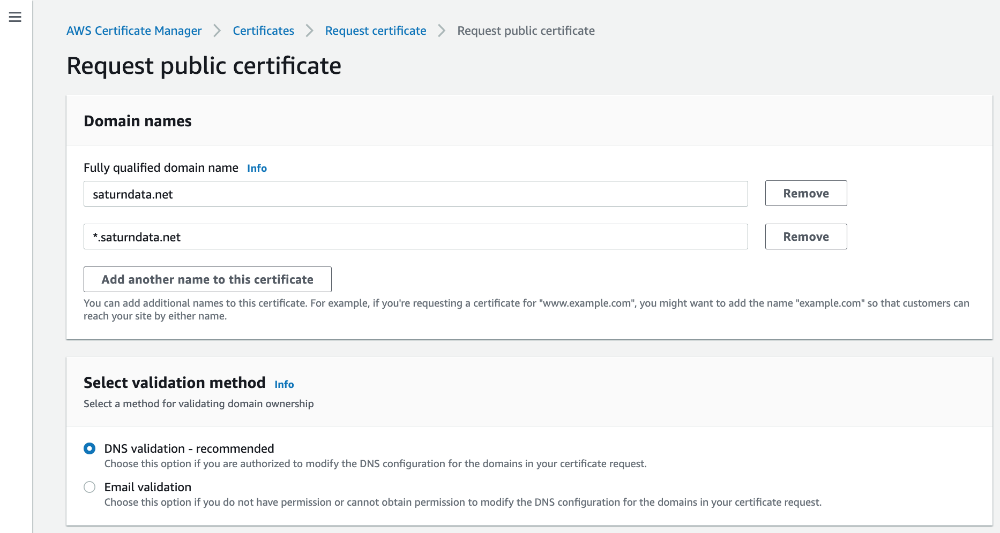
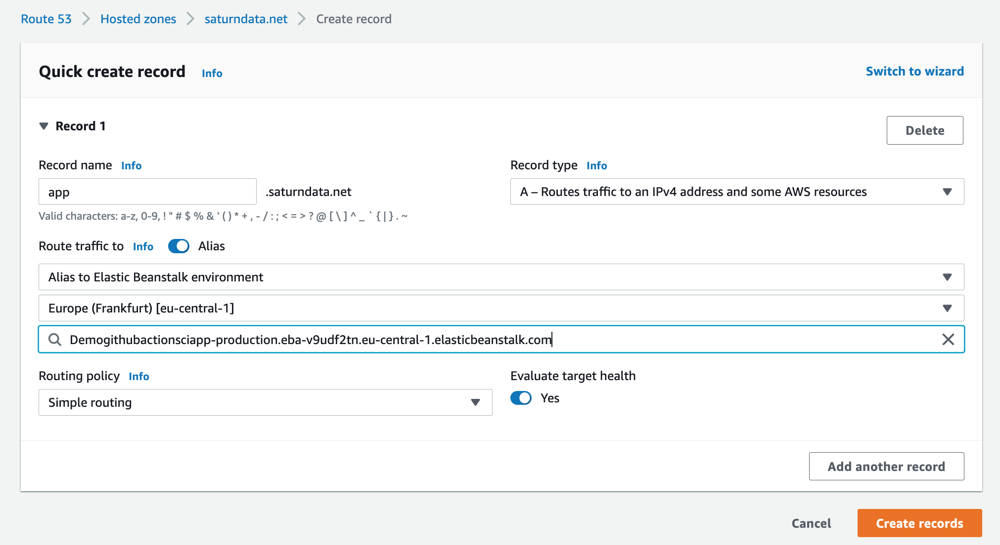

### Options
- Management Console
- Elastic Beanstalk CLI

## Create ACM Certificate
- in the same Region

Request it in ACM:

- *. enables subdomains (www., api., ...)

Validate
- DNS validation (add a given CNAME record)
- Email validation

## Add HTTPS Listener in Elastic Beanstalk
- only works in load balanced environments

- SSL Policy Best Practice = use latest

## Create Route 53 record

## HTTPS Only Access
- ALB: Redirect HTTP --> HTTPS
- Redirect Elasticbeanstalk URL to https://app.saturndata.net
