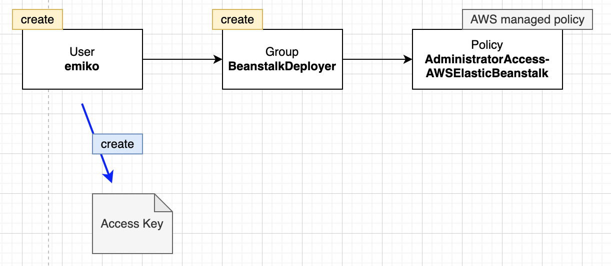
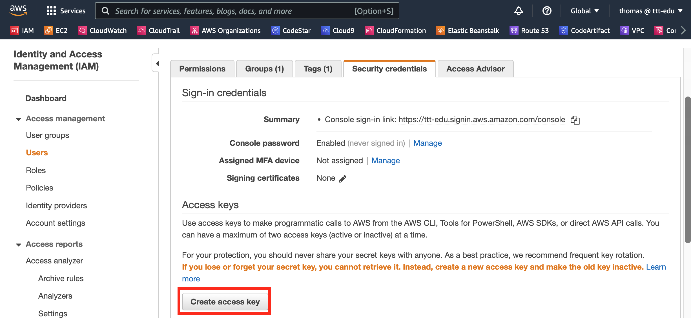
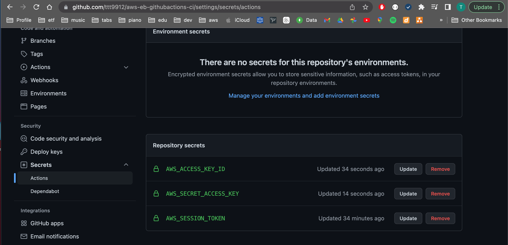

## GitHub Actions
Workflow (build.yml) can be executed
    - manually
    - automatically on push to master

## How To

### Elastic Beanstalk
- Create Application
  - Java Corretto 11 V3.1.8
  - Code: sample application
- Environment is created automatically

### AWS Credentials
1. Create user with access to Elastic Beanstalk
   

2. Create Access keys for this user
   
   - generates AWS_ACCESS_KEY_ID & AWS_SECRET_ACCESS_KEY

3. Create AWS_SESSION_TOKEN

### GitHub secrets
- AWS_ACCESS_KEY_ID
- AWS_SECRET_ACCESS_KEY
- AWS_SESSION_TOKEN: optional

### GitHub Actions Workflow

1. Create File .github/workflows/build.yml
   - Jobs: test, build, deploy

2. Git push
   - Workflow will be executed automatically

curl "https://awscli.amazonaws.com/AWSCLIV2.pkg" -o "AWSCLIV2.pkg"
sudo installer -pkg AWSCLIV2.pkg -target /
